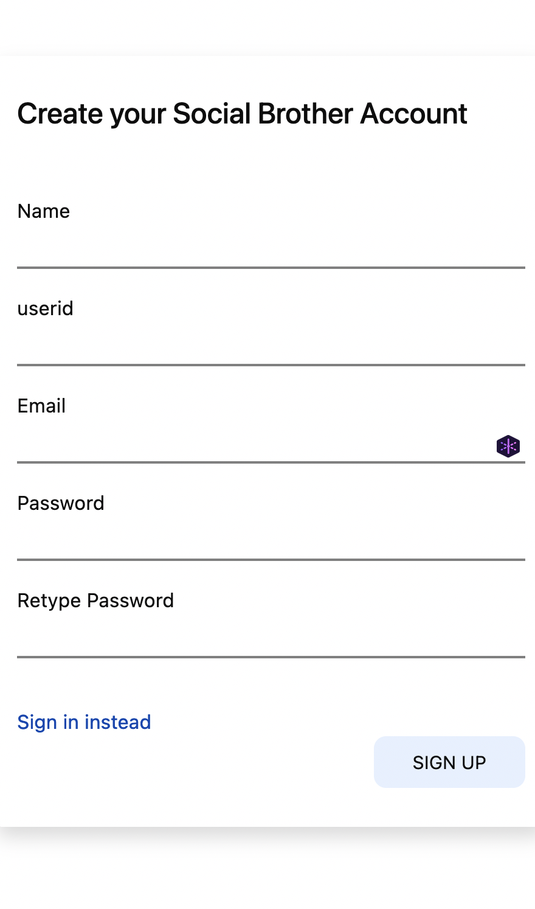

# Url Shortner

## Product demo

To use this app click on [this](https://shq.herokuapp.com/) link

### Test Credentials

username :- aksh45
password :- CRu39XBUPkufVji

### Short Urls

https://shq.herokuapp.com/aksh45/instagram

https://shq.herokuapp.com/aksh45/github

### Password Protected Urls

https://shq.herokuapp.com/aksh45/gitlab

password:- akshit

This website allows you to manage all your urls at a single platform

## Website Overview(Mobile View) 

### Login Screen

### Signup Screen

### Forgot Password Screen

### Url Management Screen

## Website Overview(Desktop View)

### Login Screen

### Signup Screen

### Forgot Password Screen

### Url Management Screen

In case you are not able to connect to the website, then it might be possible that heroku dyno is down.